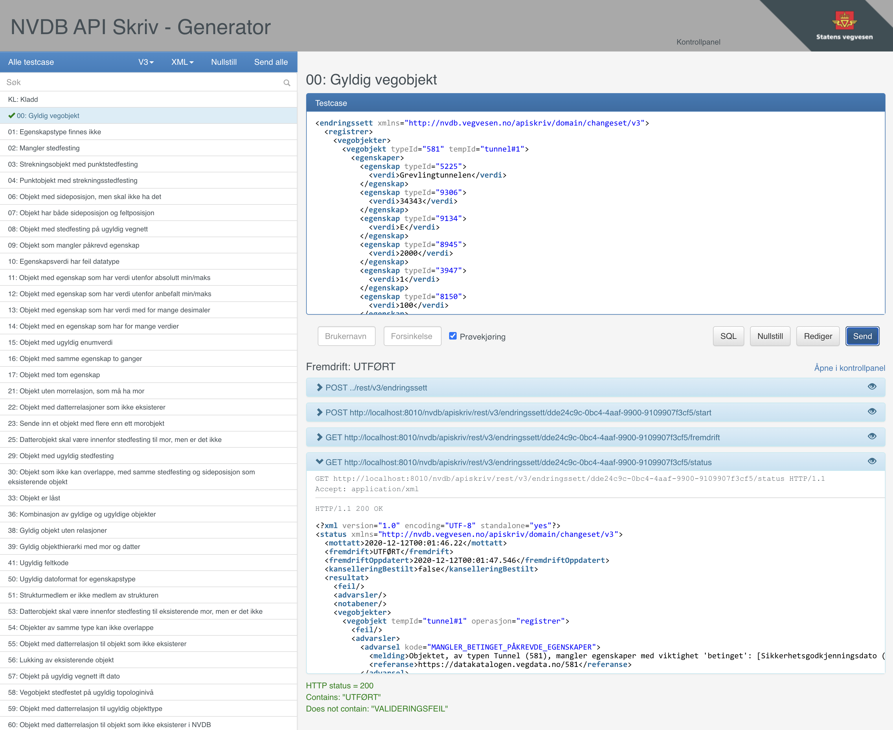

Generator er en testklient for NVDB API Skriv. Dette er en webapplikasjon som eksponeres av NVDB API Skriv sammen med øvrige REST-endepunkter.
I applikasjonen kan man sende inn forhåndsdefinerte test case, observere arbeidsflyten under behandling og til slutt inspisere behandlingsresultatet.

Formålet med Generator er å visualisere arbeidsflyten for endringssett, illustrere oppbygging av endringssettformatet for ulike oppgaver og vise hvordan ulike valideringsfeil meldes i behandlingsresultatet.

Generator er tilgjengelig på følgende URLer:

Miljø|Formål|URL
-|-|-
STM|Systemtesting|<https://nvdbapiskriv-stm.utv.atlas.vegvesen.no/generator>
ATM|Akseptansetesting|<https://nvdbapiskriv.test.atlas.vegvesen.no/generator>
PROD|Produksjonsdrift|<https://nvdbapiskriv.atlas.vegvesen.no/generator>

### Test case

Panelet til venstre viser en liste over forhåndsdefinerte test cases. Et test case består av et [endringssett](../endringssett/introduksjon) og en samling suksesskriterier ([asserts](https://en.wikipedia.org/wiki/Assertion_(software_development)))
som beskriver forventet innhold i behandlingsresultatet etter at endringssettet har gått gjennom NVDB API Skriv.

Listen kan filtreres ved å angi søkeord i redigeringsfeltet over. I tillegg kan man velge mellom XML- og JSON-format på endringssettene. NVDB API Skriv støtter fortsatt versjon 2 av endringssettformatet og dette kan aktiveres med en egen
nedtrekksmeny. Antall test case for versjon 2 er imidlertid betydelig mindre enn for versjon 3 siden støtte for vegnett først ble introdusert i siste versjon.

### Kjøring

Når et test case aktiveres ved å klikke på det, vises tilhørende endringssett til høyre i skjermbildet. Det kan nå sendes inn for behandling av NVDB API Skriv ved å klikke **Send**. Generator vil da utføre
korrekt [arbeidsflyt](../endringssett/introduksjon#samhandling-mellom-klient-og-api) ved å først registrere, deretter sende startkommando, så polle på framdriftskode og til slutt hente endelig status
med behandlingsresultat. De ulike request-respons-syklusene vises med egne paneler med blå overskrift. Til slutt matches eventuelle suksesskriterier mot behandlingsresultatet og utfallet av dette vises under siste
request-respons-panel.

Endringssettet sendes inn i kontekst av den brukeren som åpnet Generator-applikasjonen. For å kjøre i kontekst av en annen bruker kan denne angis i redigeringsfeltet *Brukernavn*.

Redigeringsfeltet som heter *Forsinkelse* brukes til å angi antall sekunder NVDB API Skriv skal vente etter at behandlingen av endringssettet er ferdig og før det effektueres til NVDB. Feltet brukes primært i forbindelse med feilsøk.

Avkrysningsboksen **Prøvekjøring** angir om endringssettet skal behandles i såkalt *dry run*-modus, det vil si uten at det gjennomføres databasetransaksjoner mot NVDB. Denne skal som hovedregel være avkrysset. NB! Uten avkrysning vil et gyldig
endringssett bli fullstendig behandlet og NVDB blir oppdatert.

### Redigering

Ved å klikke **Rediger** kan man gjøre endringer i det aktive endringssettet. For å tilbakestille til opprinnelig endringssett klikker man **Nullstill**.

Dersom man vil prøve ut et helt nytt endringssett uten å redigere test casene kan man aktivere *Kladd* øverst i test case-listen.

### Øvrige funksjoner

Ved å klikke **SQL**-knappen for et test case med gyldig endringssett (uten valideringsfeil) får man generert [SQL](https://en.wikipedia.org/wiki/SQL)-setningen(e) som må til for å oppdatere NVDB i tråd med operasjonene i endringssettet.
Merk at det er kun innholdet i endringssettet som "oversettes" til SQL. Eventuelle følgeoppdateringer som normalt legges til endringssettet under behandling er ikke med.